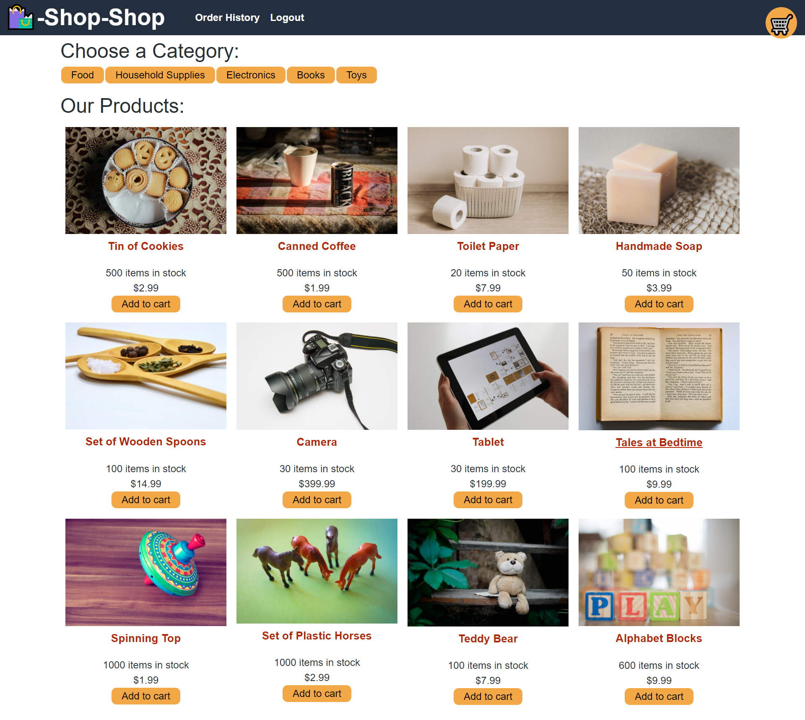

# **Shop Shop Redux** 

## **Description**
My task was to refactor code to use Redux in place of the Context API. By doing this, I took the website's state management system out of the React ecosystem.

## **Table of Contents**
* [Application](#application)
* [Original](#original)
* [Technology](#technology)
* [Tests](#tests)
* [License](#license)
* [Contact](#contact)

***

## **Application**
**Deployed:** [Shop Shop Redux](https://albenchris-shop-shop-redux.herokuapp.com/)

***

## **Original**
Deployed: [Shop Shop](https://albenchris-shop-shop.herokuapp.com/)\
Repository: [albenchris/shop-shop](https://github.com/albenchris/shop-shop)

***

## **Technology**
* MongoDB
* Express.js
* React.js
* Node.js
* Mongoose
* Apollo Server
* GraphQL
* Stripe

***

## **Tests**
If you would like to test the app, you can use the following user credentials:
* First Name: Test
* Last Name: Test
* Email: test@example.com
* Password: test12345

For a test payment, use the fake credit card number provided [here](https://stripe.com/docs/testing)
* 4242 4242 4242 4242\
*The rest of the fields don't matter*

*Quick note: Shop Shop is only an example of an e-commerce website and does not offer anything for sale. Please don't expect to get cookies or coffee in the mail!*

***

## **License**
[ISC](https://opensource.org/licenses/ISC)

***

## **Contact**
Feel free to contact me with any questions or comments!
* Github: [albenchris](https://github.com/albenchris)
* LinkedIn: [Alexander Christopherson](https://www.linkedin.com/in/alexander-christopherson-2b32085a/)
* Email: albenchris00@gmail.com
